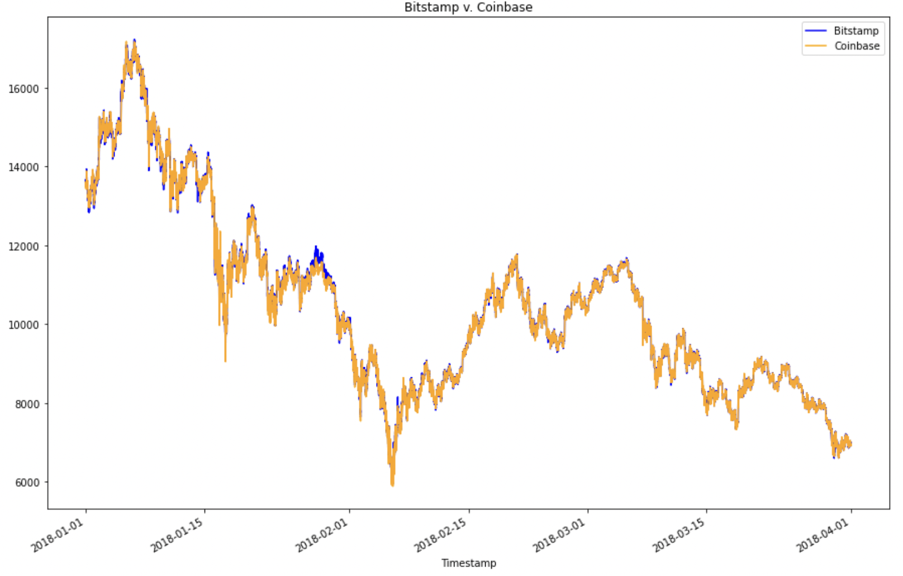
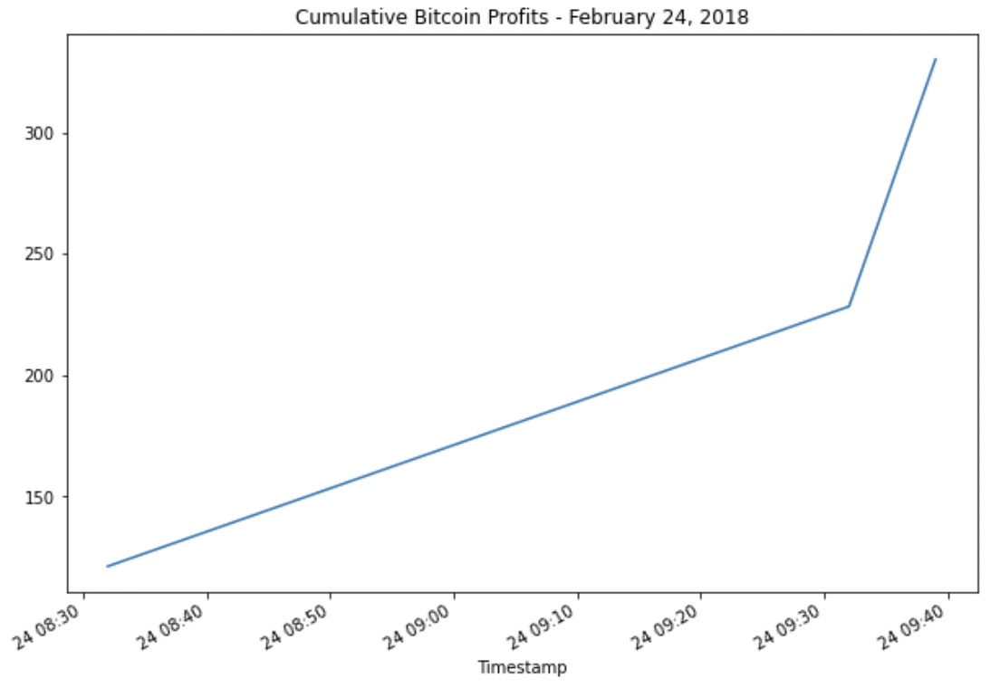

# Crypto Arbitrage Calculations

### This is a cryptocurrency arbitrage analysis of bitcoin's historical data from January - March 2018 on two different platforms: Bitstamp and Coinbase. Analysis and calculations were made after preparing and cleaning the data.

---

## Technologies

This project leverages python 3.9 and Jupyter lab notebook was used to run all analysis.

---

## Installation Guide

Before running the application first import the following libraries and dependencies.

```python
  import pandas as pd
  from pathlib import Path
  %matplotlib inline
```

---

## Collect the data

Using the Pandas `read_csv` function and the `Path` module, both Bitstamp and Coinbase databases were imported and then created into dataframes. The DatetimeIndex was set as teh Timestamp column and the dates were parsed and formatted:

```python
bitstamp_df = pd.read_csv(
    Path('./Resources/bitstamp.csv'),
    index_col="Timestamp",
    parse_dates=True,
    infer_datetime_format=True
)
```

---

## Preparing the data

For both databases, `NaN` or missing values were all replaced or droped . Then, the `str.replace` function was used to remove the dollar signs ($) from the values in the columns. The data type of the Close column was converted to a `float`. Finally, `duplicated().sum()` was used to make sure there were no duplicates in each datafram.

Main functions used were the following:

\*`loc` : to identify the Close column

\*`dropna()` : to remove all missing values

\*`float` : to convert data to float

\*`duplicated.().sum()` : to double check if there are any duplicates; sum should be **zero**.

---

## Data Analysis

To best analyze the trading profits on each platform, the analysis focused on the closing price.
To do so, a new dataframe was created for Bitstamp (bitstamp_sliced) and Coinbase (coinbase_sliced), which contains the Timestamp index and the Close column.

Both dataframes were then overlayed to create a visualization of patterns:



However, to better visualize the data, an overlay plot of January and March 2018 were created in an attempt to find any drastic spread changes over time. Unfortunately, there were no big changes over these two months in 2018.

To dig deeper, three separate dates were chosen to look at the early, middle, and late trading days to evaluate for arbitrage profitability.

For each date, the main calculations used were the following to understand and visualize the data:

```python
arbitrage_spread_early = coinbase_sliced.loc['DATE'] - bitstamp_sliced.loc['DATE']
arbitrage_spread_early.describe()
arbitrage_spread_early.plot(kind='box')
```

- **For January 16th**, there were 1419 data points where the average difference between the two prices is $23.21. The maximum difference was $606.80 and the minimum difference was -$275.92, which means that a time existed when Bitstamp had a higher price than Coinbase.

- **For February 24th**, there were 1437 data points where the average difference between the two prices is $3.40. The maximum difference was $121.32 and the minimum difference was -$50.18, which means that a time existed when Bitstamp had a higher price than Coinbase.

- **For March 26th**, there were 1432 data points where the average difference between the two prices is -$0.72. The maximum difference was $35.07 and the minimum difference was -$32.04, which means that a time existed when Bitstamp had a higher price than Coinbase.

---

## Arbitrage Profit Calculations

Then, the following calculations were made for each chosen dates:

- The **arbitrage spread** between the two exchanges were measured by subtracting the lower-priced exchange (Bitstamp) from the higher-priced one (Coinbase). Calculations were carried out for Jan. 16th, Feb. 24th, and Mar. 26th using the following calculations:

```python
arbitrage_spread = coinbase_sliced.loc['DATE'] - bitstamp_sliced.loc['DATE']
arbitrage_spread[arbitrage_spread>0].describe()
```

- Then, the **spread returns** were also calculated for each date using the following calculations:

```python
spread_return= arbitrage_spread[arbitrage_spread>0] / bitstamp_sliced.loc['DATE']
spread_return[arbitrage_spread>0]
```

- Lastly, summary statistics of the **spread returns greater than 1%** were then generated for each date using the following calculations:

```python
profitable_trades= spread_return[spread_return>0.01]
profitable_trades.head()
profitable_trades.describe()
```

In summary, the results demonstrated that:

- **For January 16th**, there were 73 profitable trades with over 1% returns.
- **For February 24th**, there were 3 profitable trades with over 1% returns.

* **For March 26th**, however, there were no positive returns greater than 1% generated.

Next, **potential profits** were then only calculated for January 16th and February 24th using the calculations below (all missing valus were dropped. )

```python
profit = profitable_trades * bitstamp_sliced.loc['DATE']
profit
profit_per_trade= profit.dropna()
```

From the two profitable trade days, the `sum() ` was used to calculate the sum of the potential profits.

- **For January 16**, the sum was $14,147.17
- **February 24**, it was $330.70.

Lastly, using the `cumsum` function, the cumulative profits over time for January 16th and February 24th were generated and plotted.

**Jan 16, 2018 cumulative**


January 16th: there were surges in profits before 6am and between 6pm and 8pm but there was only little arbitrage opportunity between 6am and 6pm for returns greater than 1%.

**Feb 16, 2018 cumulative**



February 24th: there were only three times where there was a profitable trade so the line plot shows the connection of those three time points: 8:32am, 9:32am, and 9:39am.

---

## Conclusion

In the three random (early, middle, and late) dates we chose in 2018, Bitcoin generated the most profitable arbitrage profits on January 16th and had the longest timeframe for profitable trades, totalling $14,147.70 in 73 trades. February 24th was also profitable but only within the first hour of the day that generated a cumulative profit of $330.07 in 3 trades.
